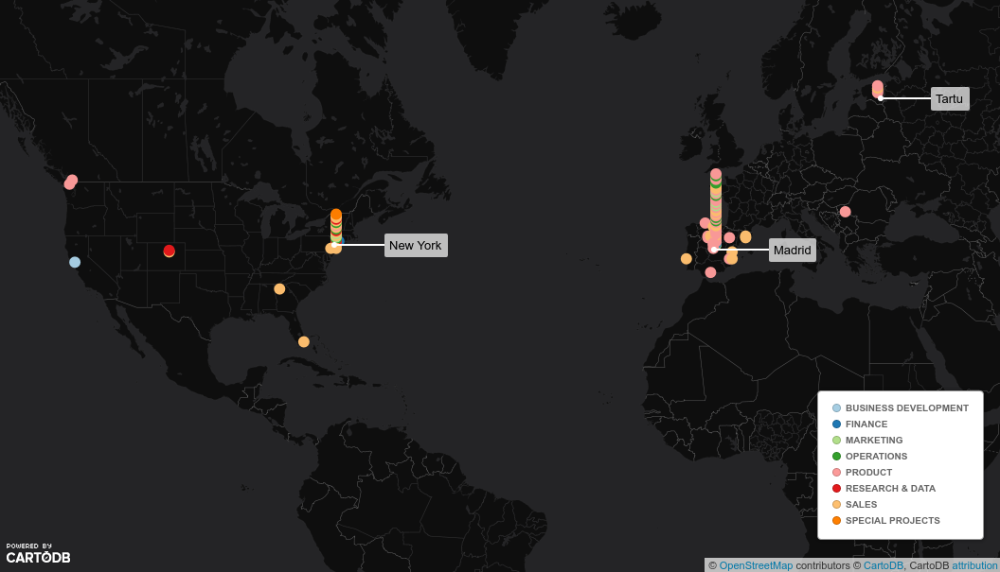
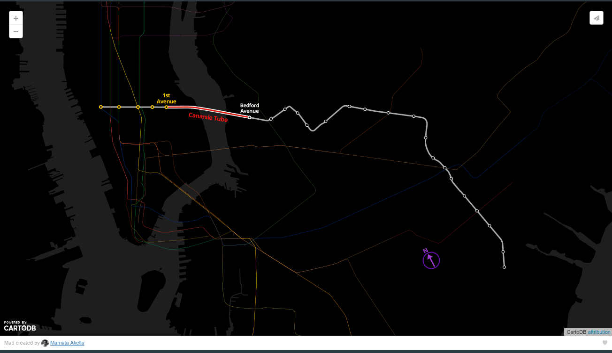
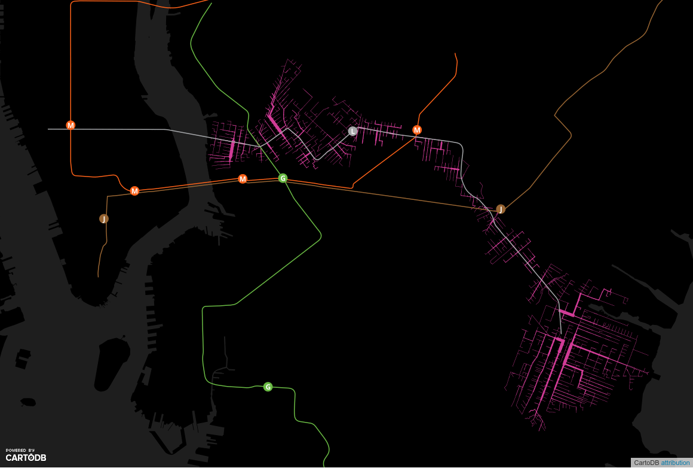
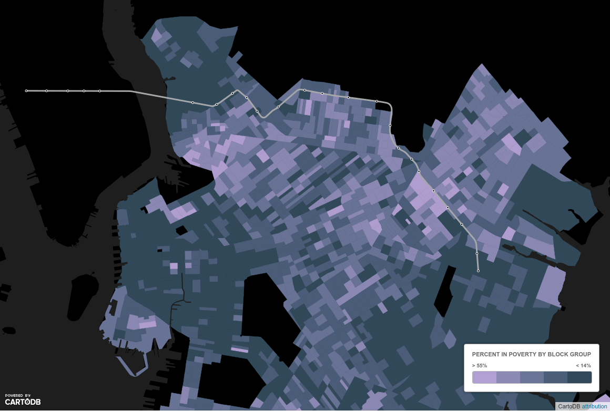

# *Making visible the invisible*
## the L Train closure

Jorge Sanz · [jorge@cartodb.com](mailto:jorge@cartodb.com) · [@xurxosanz](http://twitter.com/xurxosnaz)

Eurostat 2016 Visualization Workshop

<!-- .element: style="width:10%;" -->

___

## Agenda

- Problem definition
- Current status
- Proposed solution
- Technology

___

## About us

- CartoDB: location intelligence SaaS
- Since 2011
- ~100 employees
- Offices in Madrid, NYC and Tartu
- ~200K users

 <!-- .element: style="width:65%;" -->

---

# Problem definition

* After Sandy hurricane, the NY Canarsie tunnel was affected
* Authorities (MTA) are planning to shut down the L train line
* This situation can last *years*
* How this line shutdown will affect to New Yorkers?

___

## Overview the L Train



<!-- <div class="wrap">
  <iframe width='100%' height='520' frameborder='0' src='https://team.cartodb.com/u/mamataakella/viz/df39c134-bd38-11e5-927e-0ecfd53eb7d3/embed_map' allowfullscreen webkitallowfullscreen mozallowfullscreen oallowfullscreen msallowfullscreen></iframe>
</div> -->

___

## Overview the L Train

 <!-- .element: style="width:40%;" -->

- Major connection between Manhattan an Brooklyn
- ~27.000 passenger per workday (2014 data)
- With its modern signaling, L line can have more trains

---

# Current status

___

## Data available

- Demographics from [American Community Survey (ACS)](https://www.census.gov/programs-surveys/acs/)
- Home and work dynamics from [LODES](http://lehd.ces.census.gov/data/)
- [L entrances](https://nycopendata.socrata.com/Transportation/Subway-Entrances/drex-xx56)

___

## Analysis

> **Objective**: study the relation between people from Brooklyn
> commuting to Manhattan and the L line.

- Census blocks as base <br/> geographic information
- Relation with L entrances using <br/> walking route and travel time

___

## Walking paths

<!-- .element: style="width:70%;" -->

*Map of number of Brooklyn walkers using L train <br/>within a 30 minutes range*

Note:
SE and NW areas of Brooklyn are not covered by any other subway. We limited to 30 minutes ride and Census data doesn't reflect commuters taking a bus to
arrive to the subway entrance.

___

## Commuting time


- ~500K people from Brooklyn work at Manhattan
- ~200K L Train commuters per day
- ~114K use the L train to work at Manhattan

> *People try to live close to their jobs*

<!-- <div class="wrap">
  <iframe width="100%" height="520" frameborder="0" src="https://team.cartodb.com/u/mamataakella/viz/69d84614-be1d-11e5-8e44-0e674067d321/embed_map" allowfullscreen="" webkitallowfullscreen="" mozallowfullscreen="" oallowfullscreen="" msallowfullscreen=""></iframe>
</div> -->

---

# Scenario

## *closing the Canarsie tunnel*

<!-- .element: style="width:45%;" -->
___

## Affected population

<!-- .element: style="width:65%;" -->

> L is the closest line for ~19K low income households

<!-- <div class="wrap">
  <iframe width="100%" height="520" frameborder="0" src="https://team.cartodb.com/u/mamataakella/viz/ada51418-bebc-11e5-a121-0e5db1731f59/embed_map" allowfullscreen="" webkitallowfullscreen="" mozallowfullscreen="" oallowfullscreen="" msallowfullscreen=""></iframe>
</div> -->

___

## Affected population

<!-- .element: style="width:70%;" -->

<!-- <div class="wrap">
  <iframe width="100%" height="520" frameborder="0" src="https://team.cartodb.com/u/mamataakella/viz/945f06fa-bebf-11e5-b767-0e787de82d45/embed_map" allowfullscreen="" webkitallowfullscreen="" mozallowfullscreen="" oallowfullscreen="" msallowfullscreen=""></iframe>
</div> -->

___

## Affected population

<!-- .element: style="width:30%;" -->

- Most affected areas would be <br/>Brownsville and East New York
- More wealthy population can look for<br/>other transport methods (uber, lyft)
- MTA suggested bus shuttles

<!-- <div class="wrap">
  <iframe width="100%" height="520" frameborder="0" src="https://team.cartodb.com/u/mamataakella/viz/945f06fa-bebf-11e5-b767-0e787de82d45/embed_map" allowfullscreen="" webkitallowfullscreen="" mozallowfullscreen="" oallowfullscreen="" msallowfullscreen=""></iframe>
</div> -->

---

# Proposed solution

> Bus shuttles to substitute the Canarsie tunnel

- Williamsburg to Lower East Side
- ~20 minutes ride
- Is it worth?

___

## Bus shuttle: best choice?

<!-- .element: style="width:80%;" -->

<!-- <div class="wrap">
  <iframe width="100%" height="520" frameborder="0" src="https://team.cartodb.com/u/mamataakella/viz/945f06fa-bebf-11e5-b767-0e787de82d45/embed_map" allowfullscreen="" webkitallowfullscreen="" mozallowfullscreen="" oallowfullscreen="" msallowfullscreen=""></iframe>
</div> -->
___

## Bus shuttle: best choice?

<!-- .element: style="width:30%;" -->

Shuttle is the best choice for ~75.000 riders per day

- 1154 bus rides (65 pax/bus)
- One bus every 90 seconds
- This almost means NYC needs a new bridge!!

___

## Increasing bus time


- Shuttle are only interesting if they take less than 29 minutes
- Then all commuters would better use M line

---

# Technology


___


## CartoDB as an analysis platform

- Postgres + PostGIS
- Mapzen Valhalla routing exposed as SQL functions
- Custom python functions embedded

___

## CartoDB Data Services API

Expose third party services through SQL:

- Geocoding: Mapzen, HERE, Google
- Routing: Mapzen
- Trade Areas: HERE

___

## Example: Geocoding + Routing

```sql
SELECT
  st_transform(shape, 3857) as the_geom_webmercator
FROM
cdb_route_point_to_point(
  cdb_geocode_street_point('Calle Moreno Nieto, 2, 28005 Madrid'),
  cdb_geocode_street_point('fernandez de la hoz 35, madrid'),
  'car',
  ARRAY['mode_type=shortest']::text[]
)
```
___

## Technology: geocoding + routing


---

# Next steps

## What are we doing at CartoDB?

We want to provide for **everyone**:

- A beter UI
- Reference data
- More analysis functions, beyond PostGIS
- Better LDS

---

# Thanks!

## Making visible the invisible: <br/> the L Train closure

Jorge Sanz · [jorge@cartodb.com](mailto:jorge@cartodb.com) · [@xurxosanz](http://twitter.com/xurxosnaz)

<!-- .element: style="width:10%;" -->
___

# Credits

- [L-Train](https://commons.wikimedia.org/wiki/File:R160A_L_Train.JPG)
- [Canarsie tunnel](http://www.nydailynews.com/new-york/brooklyn/mta-reveals-train-shutdown-plans-tunnel-repair-article-1.2625451)
