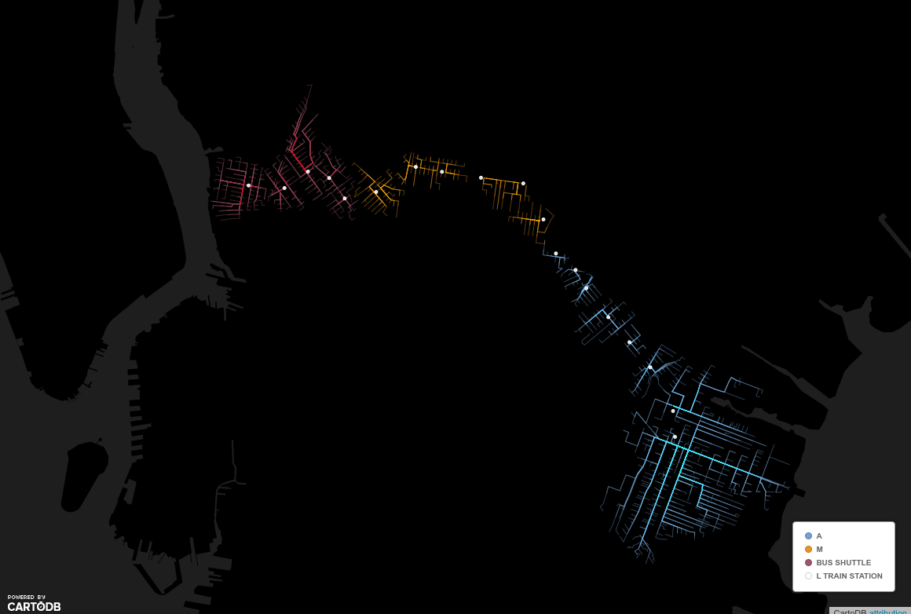

# *Making visible the invisible*
## the L Train closure

<!-- .element: style="width:40%;" -->
___


<!-- .element: style="width:15%;" -->

- Jorge Sanz
- [jorge@cartodb.com](mailto:jorge@cartodb.com)
- [@xurxosanz](http://twitter.com/xurxosnaz)
- Solutions engineer and Support manager

___

## About us

- CartoDB: location intelligence SaaS
- ~200K users
- Since 2011
- ~100 employees
- Offices in Madrid, NYC and Tartu

<iframe width='80%' height='400' frameborder='0' src='https://team.cartodb.com/u/jsanz/viz/4ddc4fd8-fcb5-11e5-914a-0ef7f98ade21/embed_map?zoom=3&center_lat=46&center_lon=-50' allowfullscreen webkitallowfullscreen mozallowfullscreen oallowfullscreen msallowfullscreen></iframe>

___

## Agenda

- Problem definition
- Current status
- Proposed solution
- Technology
- Looking forward

---

# Problem definition

> After Sandy, the NY Canarsie tunnel was affected

<!-- .element: style="width:60%;" -->
___


___

## Problem definition

* Authorities (MTA) are planning <br/>to **shut down** the Canarsie tunnel (2019?)
* This situation can last **years**
* How this line shutdown will affect to New Yorkers?

Note:
The Metropolitan Transport Authority wants to close the Canarsie tunnel.
___

## Overview the L Train

> **Major connection** between <br/>Manhattan (8th av) and Brooklyn

<iframe width='100%' height='400' frameborder='0' src='https://team.cartodb.com/u/mamataakella/viz/df39c134-bd38-11e5-927e-0ecfd53eb7d3/embed_map?zoom=13' allowfullscreen webkitallowfullscreen mozallowfullscreen oallowfullscreen msallowfullscreen></iframe>

___

## Overview the L Train

 <!-- .element: style="width:40%;" -->

- With its modern signaling, L line <br/> can have **more trains**
- For example Bedford Av admits <br/> **~27.000** passenger per workday (2014 data)

___

## The Canarsie Tunnel and Sandy

* 2.3 km long
* 200,000 daily riders
* 26.5 million liters of saltwater
* Closed 11 days

Source: http://web.mta.info/sandy/river_crossings.htm

---

# Current status

___

## Data available

- Demographics from [American Community Survey (ACS)](https://www.census.gov/programs-surveys/acs/)
- Home and work dynamics from [LODES](http://lehd.ces.census.gov/data/)
- [L entrances](https://nycopendata.socrata.com/Transportation/Subway-Entrances/drex-xx56)

<!-- .element: style="width:60%;" -->


Note:
LODES: Longitudinal Employer-Household Dynamics, Origin-Destination Employment statistics
___

## Analysis

> **Objective**: study the relation between people from Brooklyn
> commuting to Manhattan and the L line.

- **Census blocks** as base <br/> geographic information
- Relation with L entrances using <br/> **walking route** and **travel time**

___

## Walking paths

<iframe width="100%" height="450" frameborder="0" src="https://team.cartodb.com/u/mamataakella/viz/69d84614-be1d-11e5-8e44-0e674067d321/embed_map?zoom=13" allowfullscreen="" webkitallowfullscreen="" mozallowfullscreen="" oallowfullscreen="" msallowfullscreen=""></iframe>
</div>

*Brooklyn walkers using L train within a **30min.** range*

Note:
SE and NW areas of Brooklyn are not covered by any other subway. We limited to 30 minutes ride and Census data doesn't reflect commuters taking a bus to
arrive to the subway entrance.

___

## Commuting time


- ~500K people from Brooklyn work at Manhattan
- ~200K L Train commuters per day
- ~114K use the L train to work at Manhattan

> *People try to live **close** to their jobs*<!-- .element: class="fragment" -->

Note:
Proportion of people who work in Manhattan versus walk and/or subway commute time
---

# Scenario

## *closing the Canarsie tunnel*

<!-- .element: style="width:45%;" -->
___

## Affected population

<iframe width="100%" height="450" frameborder="0" src="https://team.cartodb.com/u/mamataakella/viz/ada51418-bebc-11e5-a121-0e5db1731f59/embed_map" allowfullscreen="" webkitallowfullscreen="" mozallowfullscreen="" oallowfullscreen="" msallowfullscreen=""></iframe>

> L is the closest line for <br/>**~19K** low income households


___

## Affected population

<iframe width="100%" height="520" frameborder="0" src="https://team.cartodb.com/u/mamataakella/viz/945f06fa-bebf-11e5-b767-0e787de82d45/embed_map?zoom=13" allowfullscreen="" webkitallowfullscreen="" mozallowfullscreen="" oallowfullscreen="" msallowfullscreen=""></iframe>
___

## Affected population

<!-- .element: style="width:30%;" -->

- Most affected areas would be <br/>Brownsville and East New York
- More wealthy population can look for<br/>other transport methods (uber, lyft)
- MTA suggested bus shuttles

---

# Proposed solution

> Bus shuttles to substitute the Canarsie tunnel

- Williamsburg to Lower East Side
- ~20 minutes ride
- **Is it worth?**

___

## Bus shuttle: best choice?

<iframe width="100%" height="520" frameborder="0" src="https://team.cartodb.com/u/mamataakella/viz/5259fece-be2c-11e5-9d6a-0e98b61680bf/embed_map" allowfullscreen="" webkitallowfullscreen="" mozallowfullscreen="" oallowfullscreen="" msallowfullscreen=""></iframe>
___

## Bus shuttle: best choice?

<!-- .element: style="width:30%;" -->

Shuttle is the best choice for ~75.000 riders per day

- 1154 bus rides (65 pax/bus)<!-- .element: class="fragment" -->
- One bus every 90 seconds<!-- .element: class="fragment" -->
- This almost means NYC needs a new bridge!!<!-- .element: class="fragment" -->

___

## Increasing bus time


- Shuttle are only interesting if they take less than 29 minutes
- Then all commuters would better use M line

---

# Technology


__

## CartoDB as an location intelligence platform

- Postgres + PostGIS
- Custom python functions embedded
- Mapzen Valhalla routing exposed as <span class="fragment highlight-current-orange">SQL functions</span>

___

## CartoDB Data Services API

Expose third party services through SQL:

- Geocoding: Mapzen, HERE, Google
- Routing: Mapzen
- Trade Areas: HERE
___

## Example: Geocoding + Routing

```sql
SELECT
  st_transform(shape, 3857) as the_geom_webmercator
FROM
cdb_route_point_to_point( -- routing!!
  cdb_geocode_street_point('Calle Moreno Nieto, 2, 28005 Madrid'), --geocoding!!
  cdb_geocode_street_point('fernandez de la hoz 35, madrid'),--geocoding!!
  'car',
  ARRAY['mode_type=shortest']::text[]
)
```
___

## Example: geocoding + routing


___

## Example: live routing

<iframe width="100%" height="520" frameborder="0" src="https://cartodb.github.io/cartodb-routing-demo/" allowfullscreen="" webkitallowfullscreen="" mozallowfullscreen="" oallowfullscreen="" msallowfullscreen=""></iframe>
___

## Example: trade areas

<iframe width="100%" height="520" frameborder="0" src="https://cartodb.github.io/labs-trade-areas-subway/" allowfullscreen="" webkitallowfullscreen="" mozallowfullscreen="" oallowfullscreen="" msallowfullscreen=""></iframe>

---

# Looking forward

For **everyone**, everything at https://github.com/CartoDB/

- Better Location Data Services<!-- .element: class="fragment" -->
- More analysis functions, beyond PostGIS<!-- .element: class="fragment" -->
- A beter UI: new CartoDB Editor<!-- .element: class="fragment" -->
- Reference data: the Data Observatory<!-- .element: class="fragment" -->

---

## Thanks!

<!-- .element: style="width:40%;" -->

Jorge Sanz · [jorge@cartodb.com](mailto:jorge@cartodb.com) · [@xurxosanz](http://twitter.com/xurxosnaz)

http://bit.ly/160518-ltrain

<!-- .element: style="width:7%;" -->
___

# Credits

- [Tunnel Flood](https://en.wikipedia.org/wiki/Effects_of_Hurricane_Sandy_in_New_York)
- [L-Train](https://commons.wikimedia.org/wiki/File:R160A_L_Train.JPG)
- [Canarsie tunnel](http://www.nydailynews.com/new-york/brooklyn/mta-reveals-train-shutdown-plans-tunnel-repair-article-1.2625451)
